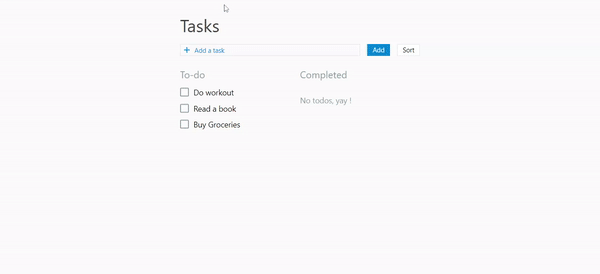

# React-redux-hooks-todo-sort-set-priority-drag-and-drop-
The repository contains source code for a todo web app created with react, redux and hooks.

To run and use the application:

1. clone the project

2. npm i

3. npm start

The application contains implementation of Redux, Sorting alphabetically and back, Position tasks for priority, Drag and drop tasks as completed or pending.

